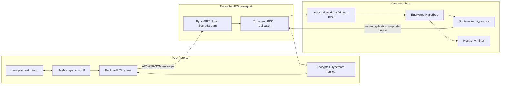

# Hackvault

<p align="center"><strong>Peer-to-peer encrypted secrets with automatic, bidirectional <code>.env</code> sync</strong></p>

<p align="center">Run one canonical vault host, connect peers by public key, and keep project secrets synchronized without a central secrets service.</p>

<p align="center">
  <a href="https://nodejs.org/"></a>
  <a href="LICENSE"></a>
  <a href="#security-model"></a>
  <a href="https://docs.pears.com/building-blocks/hyperdht"></a>
</p>

<video src="https://github.com/user-attachments/assets/f24c362b-0409-45d7-b613-93531fefd8a8" controls muted playsinline width="100%" title="Hackvault command-line demo"></video>

> If your Markdown viewer does not render video, [watch or download the 24-second demo](assets/demo.mp4).

## Why Hackvault?

Hackvault gives small teams, local agents, and multi-machine development environments a simple secret-sharing primitive:

- **Encrypted persistence** — values are encrypted with AES-256-GCM before entering Hypercore/Hyperbee.
- **Direct peer-to-peer transport** — HyperDHT SecretStreams carry RPC and native Hypercore replication.
- **Automatic `.env` mirroring** — vault writes appear in each connected project, while local `.env` edits flow back to the vault.
- **CLI-first automation** — bounded `add`, `list`, `get`, and `sync` commands return JSON and never wait on stdin.
- **Offline local replicas** — peers keep a complete disk-backed encrypted copy after synchronization.
- **Shared project context** — agents can publish durable decisions, product facts, architecture notes, conventions, and work state through a separate context domain.

## Install

Requires Node.js 22+ and npm.

```bash
curl -fsSL https://raw.githubusercontent.com/ram4-dev/pears-vault/main/scripts/install.sh | bash
```

The installer builds the current `main` branch, stores the runtime in `~/.local/share/hackvault`, and creates the `hackvault` command in:

- Homebrew's bin directory on macOS when it is writable, including `/opt/homebrew/bin` on Apple Silicon.
- `~/.local/bin` on macOS or Linux otherwise.

It is safe to run again to update the installation. If the selected bin directory is not on `PATH`, the installer prints the exact path to add.

```bash
hackvault --help
```

Uninstall only files managed by the installer:

```bash
curl -fsSL https://raw.githubusercontent.com/ram4-dev/pears-vault/main/scripts/install.sh | bash -s -- --uninstall
```

## Quick start

### 1. Start the canonical host

From the project whose `.env` should be mirrored:

```bash
hackvault host start
```

Wait for the host to print:

```text
HACKVAULT_PUBLIC_KEY=<64-character-public-key>
Host is serving encrypted vault replication and peer write requests.
```

Keep this process running and copy the public key.

### 2. Add a secret from another terminal or machine

```bash
hackvault add <public-key> API_TOKEN demo-value
```

```json
{"ok":true,"name":"API_TOKEN"}
```

### 3. List the vault

```bash
hackvault list <public-key>
```

```json
["API_TOKEN"]
```

### 4. Use the synchronized project environment

Hackvault writes the decrypted value to the nearest Git project root:

```dotenv
API_TOKEN=demo-value
```

Edit that line locally and Hackvault upserts the new value. Remove the managed line and Hackvault deletes the key from the canonical vault and every connected peer.

## CLI reference

| Command | Purpose | Output / behavior |
| --- | --- | --- |
| `hackvault host start` | Start the canonical writable vault and DHT server. | Prints `HACKVAULT_PUBLIC_KEY`; stays running. |
| `hackvault join <public-key>` | Join interactively and keep a live replica. | Opens a REPL with `add`, `list`, `get`, `help`, and `exit`. |
| `hackvault add <public-key> <name> <value>` | Add or replace one encrypted value. | JSON: `{"ok":true,"name":"…"}`. |
| `hackvault list <public-key>` | List key names without values. | JSON array of names. |
| `hackvault get <public-key> <name>` | Decrypt one value locally. | JSON object; missing keys return `value: null`. |
| `hackvault sync <public-key>` | Download every current block and reconcile `.env`. | JSON synchronization status, then exits. |
| `hackvault --help` | Show command syntax. | Prints usage and exits successfully. |

### Shared context

Hackvault context is a separate encrypted and replicated domain. It does not share the secret vault's keyspace, encryption key, or `.env` mirror. Install the project-local agent workflow from the packaged source:

```bash
hackvault context skill install --project-dir .
```

The skill is installed at `.codex/skills/hackvault-context/SKILL.md`. Context commands return exactly one JSON value on stdout and keep connection diagnostics on stderr:

```bash
hackvault context sync <public-key>
hackvault context list <public-key> [--scope <scope>] [--kind <kind>] [--limit <n>]
hackvault context get <public-key> <record-id>
hackvault context add <public-key> '<publish-json>'
hackvault context supersede <public-key> '<publish-json-with-supersedes>'
hackvault context delete <public-key> <record-id> <operation-id>
```

Publish inputs require `schema`, `operationId`, `scope`, `kind`, `title`, `body`, and `author`. Supported kinds are `decision`, `product`, `architecture`, `convention`, `work-state`, and `note`. Operation IDs make retries idempotent. Supersession and deletion remain visible in the record lifecycle metadata rather than silently erasing prior knowledge.

Synchronized context is projected read-only under `<project-root>/.pears-context/` as `index.json` plus JSON and Markdown record files. Do not edit or copy those files to publish context; use the CLI or the TypeScript API. Possession of the host public key is a bearer invitation that grants context read/write access while the host is online.

### Common options

| Option | Meaning |
| --- | --- |
| `--data-dir <path>` | Override encrypted Hypercore/Hyperbee storage. For peers, this does not move the project-root `.env`. |
| `--bootstrap <host:port,...>` | Override HyperDHT bootstrap nodes. |
| `HACKVAULT_BOOTSTRAP=host:port` | Environment equivalent of `--bootstrap`; the legacy `PEARS_VAULT_BOOTSTRAP` name remains accepted. |

Programmatic commands use bounded connection and operation timeouts, write machine-readable JSON to stdout, send diagnostics to stderr, and never read stdin. Shell-quote values containing spaces or special characters.

## Bidirectional `.env` synchronization

Hackvault treats the encrypted vault as canonical while making each local `.env` a writable integration surface.

| Local or remote event | Result |
| --- | --- |
| Add `KEY=value` to a watched `.env` | Authenticated encrypted upsert through the host. |
| Edit a managed value | New encrypted version is appended and replicated. |
| Remove a managed key line | Hyperbee tombstone; the line disappears from every connected mirror. |
| Set `KEY=` | Empty-string upsert, **not** deletion. |
| Receive a remote append or tombstone | Download through the announced length, then update `.env` before callbacks run. |
| Run a one-shot command | Reconcile edits made since the previous snapshot before executing the command. |

Long-running hosts and peers poll approximately every two seconds. Durable snapshots store only value hashes and managed key names, never a second plaintext copy. Existing comments, blank lines, unrelated variables, and safely quoted values are preserved.

### Environment locations

- Default host: the nearest Git root's `.env`, with the current directory as fallback.
- Host with `--data-dir`: `<data-dir>/.env`.
- CLI peers: nearest Git root's `.env`, independent of peer storage.
- Direct library peers without `envPath`: `<data-dir>/.env`.

Default encrypted storage intentionally remains under the legacy-compatible `.pears-vault` application directory so existing vaults continue to work after the CLI rename.

## Architecture



### Data flow

1. The host creates a persistent HyperDHT keypair, a random 256-bit vault key, and the canonical writable Hypercore.
2. A peer connects using the host public key over a HyperDHT Noise SecretStream.
3. Protomux carries control RPC and native Hypercore replication over that persistent connection.
4. Peers encrypt values locally and submit ciphertext envelopes; the host is the only Hypercore writer.
5. The host broadcasts append/tombstone metadata. Peers download and verify every announced block before updating local mirrors.

The internal `pears-vault/control/1` protocol identifier and legacy data directory remain stable for compatibility between existing installations and Hackvault.

## Security model

Hackvault encrypts database values, but it is NOT a complete enterprise secrets platform.

### What is protected

- Values at rest inside Hypercore/Hyperbee use AES-256-GCM with a unique IV and the secret name bound as authenticated data.
- DHT connections use HyperDHT's encrypted Noise SecretStream.
- Generated `.env` and snapshot files use restrictive local permissions.
- Snapshot metadata contains hashes and key names, not plaintext values.

### What remains exposed or intentionally trusted

- **`.env` mirrors are plaintext by design.** Protect project directories, backups, terminals, and logs.
- **The host public key is a bearer invitation capability.** Anyone who has it can connect and receive the current vault read/write capability while the host is online.
- There is no per-peer approval, role separation, revocation, recovery phrase, or vault-key rotation yet.
- Secret names, update timing, and approximate database size remain visible metadata.
- `get` intentionally emits plaintext JSON to stdout.
- HyperDHT does not provide relay fallback by default; incompatible NATs may prevent a direct connection.
- The host remains the canonical single writer and must be available for peer-originated mutations.

Do not publish the host public key or use Hackvault as the only copy of irreplaceable credentials.

## Development

```bash
git clone https://github.com/ram4-dev/pears-vault.git
cd pears-vault
npm install
npm run check
```

| Command | Purpose |
| --- | --- |
| `npm run build` | Compile TypeScript into `dist/`. |
| `npm test` | Run unit, CLI, installer, and P2P integration tests serially. |
| `npm run test:unit` | Run crypto and validation tests. |
| `npm run test:integration` | Run local HyperDHT end-to-end tests. |
| `npm run check` | Build, then run the complete test suite. |

### Regenerate the demo

```bash
cd remotion
npm install
npm run studio   # optional preview
npm run render   # writes ../assets/demo.mp4
```

The Remotion composition is deterministic: 720 frames at 30 fps, 1280×720, rendered as H.264 MP4.

## Built with

- [HyperDHT](https://docs.pears.com/how-to/connect-to-peers/connect-two-peers-by-key-with-hyperdht/) for peer discovery and encrypted direct connections.
- [Hypercore](https://docs.pears.com/how-to/store-and-replicate/replicate-and-persist-with-hypercore/) for append-only replication.
- [Hyperbee](https://docs.pears.com/how-to/store-and-replicate/share-append-only-databases-with-hyperbee/) for the encrypted key/value index.
- [Protomux](https://github.com/holepunchto/protomux) for multiplexed RPC and replication.
- [Remotion](https://www.remotion.dev/) for the repository demo video.

## License

[MIT](LICENSE)
